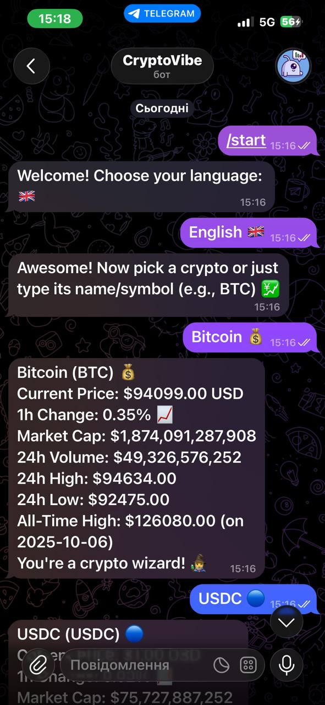

# CryptoVibe Bot 🚀

A fast and fun Telegram bot that delivers real-time prices, 1-hour changes, market cap, volume, and more for the top cryptocurrencies. Supports English and Ukrainian languages!

Powered by **CoinGecko API** (no key required) and built with **python-telegram-bot**.

### Features
- Instant crypto prices in USD 💰
- 1-hour price change with fun emojis (📈📉)
- Additional stats: market cap, 24h volume, 24h high/low, all-time high
- Top 7 popular coins with quick buttons
- Text search — just type coin name or symbol (e.g., "BTC")
- Back button & language selection (English / Українська)
- Lively responses with random motivational/crypto vibes 🌕

### Demo

  
*Short demo video of the bot working in Telegram*

  
 

### How to Run Locally

This bot runs locally and requires a terminal (it's not deployed as a 24/7 service).

1. Clone the repository:
   ```bash
   git clone https://github.com/YOUR_USERNAME/CryptoPulseBot.git
   cd CryptoPulseBot
2. Create and activate a virtual environment:Bash
python -m venv venv
venv\Scripts\activate    # Windows
# source venv/bin/activate  # macOS/Linux

3. Install dependencies:
pip install python-telegram-bot requests

4. Add your bot token:
Open main.py
Replace YOUR_TELEGRAM_BOT_TOKEN_HERE with your token from @BotFather

5. Run the bot:
python main.py  
